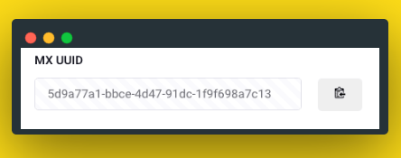

# MX UUID Field

This fieldtype auto-generates UUIDs for empty fields. This can be useful if you need unique IDs but not a title or entry_id.

## Compatibility

### ExpressionEngine
* ExpressionEngine 5
* ExpressionEngine 6

## Installation
* Place the **mx_uuid** folder inside your **user/addons** folder
* Go to **cp/addons** and install *MX UUID*

## Template Tags

	{field_name}
	
## Example

	{exp:channel:entries channel="my_secrets" search:uuid_field="{segment_2}"}
	   ...
	{/exp:channel:entries}

## ToDo
* Regenerate option
* Add copy uuid option to field

## Support Policy
This is Communite Edition  add-on.

## Contributing To MX UUID for ExpressionEngine

Your participation to MX UUID development is very welcome!

You may participate in the following ways:

* [Report issues](https://github.com/MaxLazar/mx-UUID/issues)
* Fix issues, develop features, write/polish documentation
Before you start, please adopt an existing issue (labelled with "ready for adoption") or start a new one to avoid duplicated efforts.
Please submit a merge request after you finish development.

## License

The MX UUID is open-sourced software licensed under the [MIT license](http://opensource.org/licenses/MIT)

## Thanks 

Icons made by ["Pixel perfect"](https://www.flaticon.com/authors/pixel-perfect) from [www.flaticon.com](https://www.flaticon.com/)